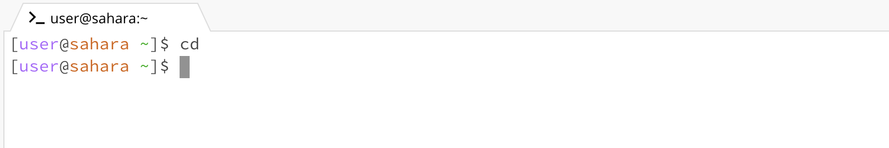
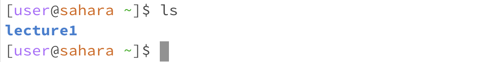
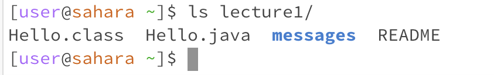
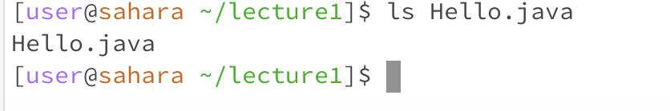
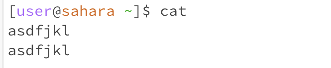
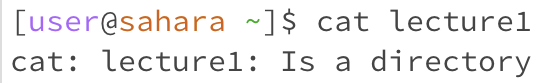
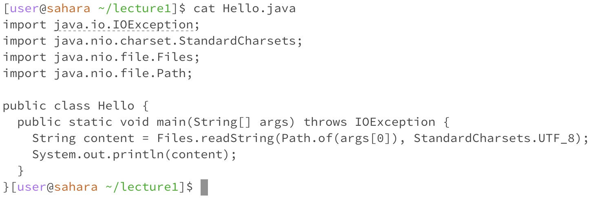

# Lab Report 1
### cd with no argument:

The current directory was the home directory. 
When cd is called without any arguments the user is returned to the home directory, however we were already in the home directory, so it didn’t do anything. 
This output was not an error since it technically changed the directory to the home directory. 

### cd with a path to a directory:

The current directory was the home directory.
I got that output because it changed the directory to the lecture1 directory and so in the next line my current directory was in the lecture1 directory.
This was not an error.

### cd with a path to a file:

The current directory was the lecture1 directory.
I got this output because Hello.java is a file and not a directory. 
This is an error since cd didn’t change the directory and instead it returned that Hello.java is not a directory. 

### ls with no argument:

The current directory was the home directory.
I got this output because lecture1 is the directory under the home directory. 
This is not an error.

### ls with a path to a directory:

The current directory was the home directory.
I got this output because Hello.class, Hello.java, and README were the files and messages was the directory under the lecture1 directory.
This is not an error.

### ls with a path to a file:

The current directory was the lecture1 directory.
I got this output because Hello.java is a file and it lists information about the file.
This is not an error.

### cat with no argument:

The current directory was the home directory.
I got no output at first, but once I typed “asdfjkl” and pressed “enter” it repeated what I typed. When cat is run without arguments, it just reads from stdin. It will continue to do this until you press ctrl + C.
This is not an error.

### cat with a path to a directory:

The current directory was the home directory.
The output I got was that lecture1 was a directory. I’m guessing this is because it cannot read the input as a directory.
This is an error since it didn’t read the content in lecture1 and output it.

### cat with a path to a file:

The current directory was the lecture1 directory.
The output I got the contents of the Hello.java file.
This is not an error.
