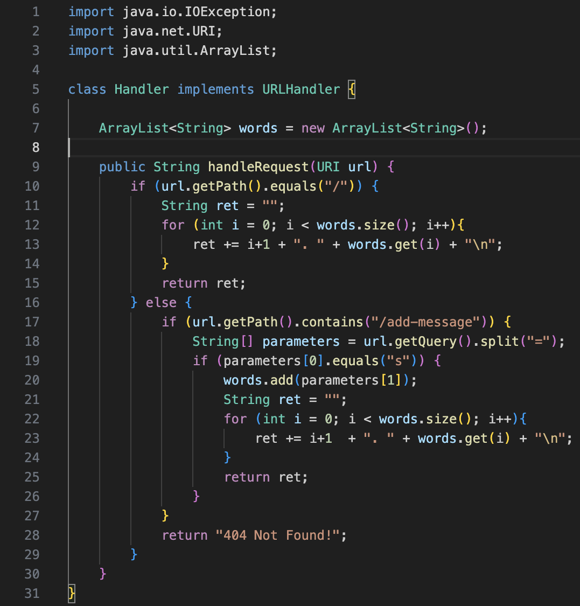
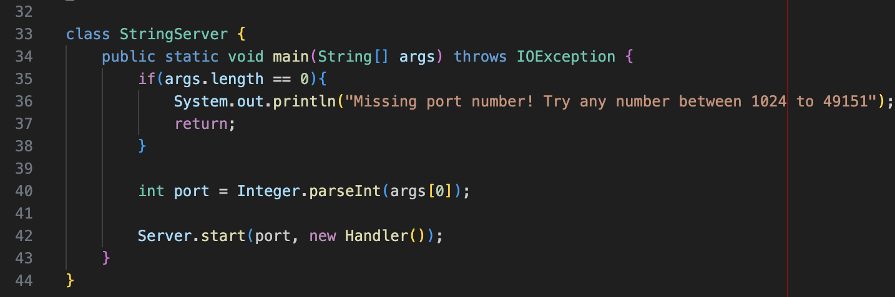
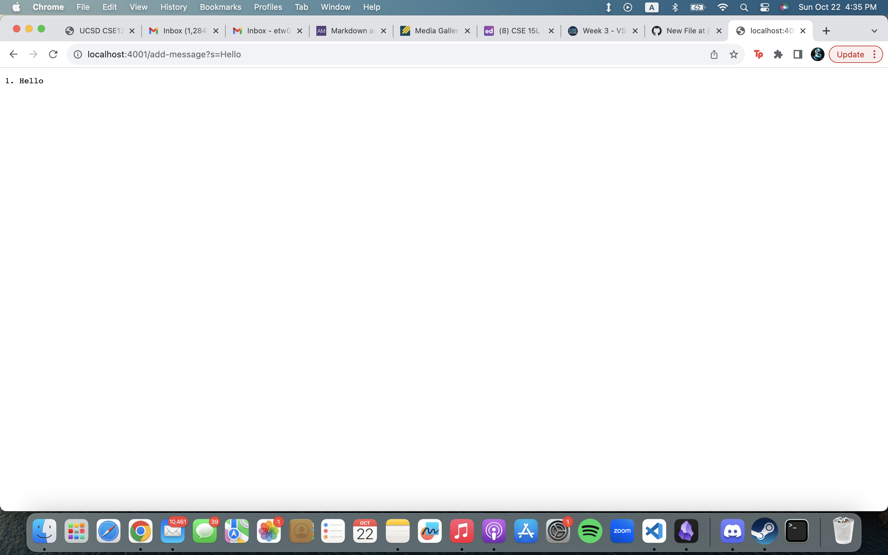
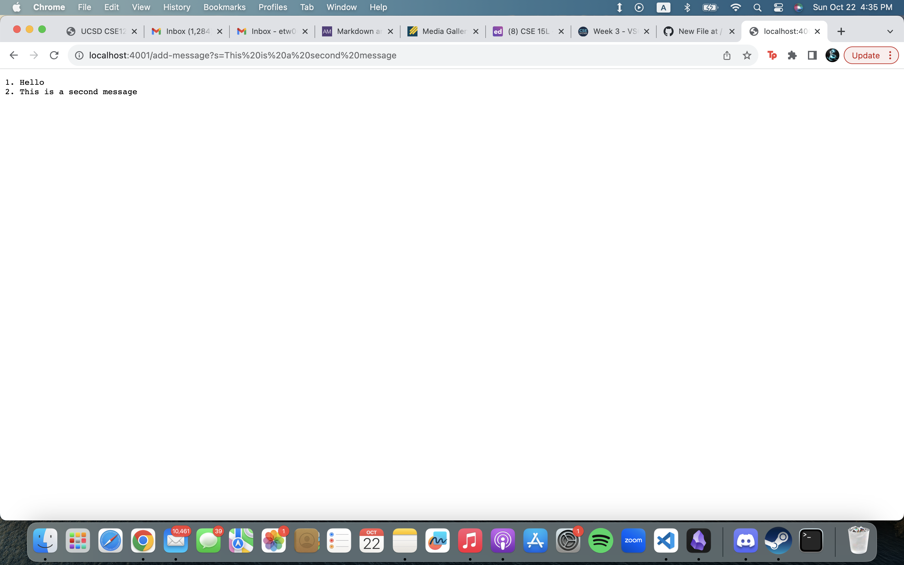
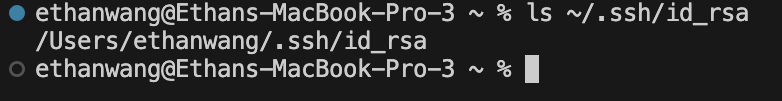
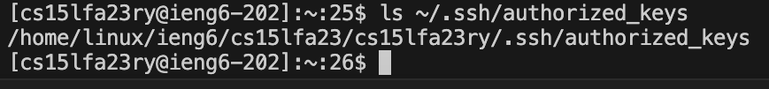
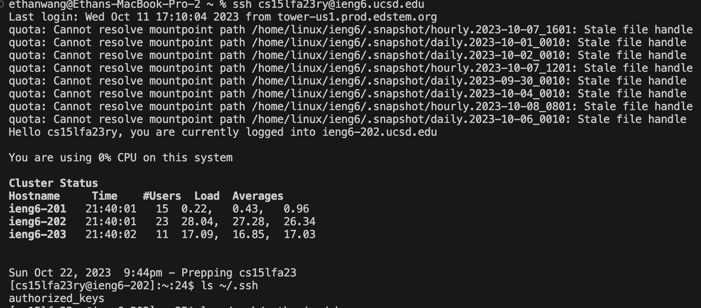

## Part 1
[java File for StringServer.java](StringServer.java)

In this code, handleRequest is called. The relevant argument is the url. The relevant class field is words, which is currently empty. The url contains the path, "/add-message", so the code will grab the query of the path and create the string array parameters. It will split the query of the path at the "=" and assign the halves to parameter. Now parameter contains "s" and "Hello". Then we add "Hello" into words and return all the values in words. Now words has "Hello" in it and is shown on the screenshot.

In this code, the handleRequest is called like the first one and the url has the same path. The only difference is in the query. Now when the code splits the query as parameter, parameter will contain "s" and "This is a second message" instead. We add the "This is a second message" into words and ret all the values in words which include "Hello" from the first time add-message was called.

## Part 2
### Private Key

### Public Key

### Login to ieng6

## Part 3
From week 3, I learned what ssh was and what it is used for. I also learned how to use ssh to login into ieng6. I even learned how to run commands and access codes from ieng6 using ssh. I didn't know what ssh was or for before this week.
