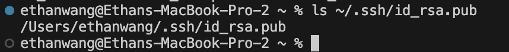

### Part 1

In this code, handleRequest is called. The relevent argument is the url. The url contains the path, "/add-message" so the code will grab the query as parameters and split it at the "=". Now parameter is a String[] that contains "s" and "Hello". Then we add the "Hello" into words and ret all the values in words.

In this code, the handleRequest is called like the first one and the url has the same path. The only difference is in the query. Now when the code splits the query as parameter, parameter will contain "s" and "This is a second message" instead. We add the "This is a second message" into words and ret all the values in words which include "Hello" from the first time add-message was called.

### Part 2

