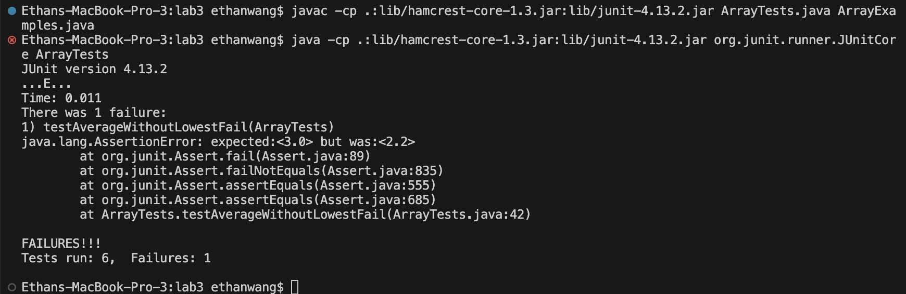

## Part 1 - Bugs
```
@Test
  public void testAverageWithoutLowestFail() {
    double[] input1 = {2,2,2,3,3,5};
    assertEquals(3.0, ArrayExamples.averageWithoutLowest(input1),0.1);
  }
```
```
@Test
  public void testAverageWithoutLowestPass() {
    double[] input1 = {1,3,3,3,3};
    assertEquals(3.0, ArrayExamples.averageWithoutLowest(input1),0.1);
  }
```

### Before
```
static double averageWithoutLowest(double[] arr) {
    if(arr.length < 2) { return 0.0; }
    double lowest = arr[0];
    for(double num: arr) {
      if(num < lowest) { lowest = num; }
    }
    double sum = 0;
    for(double num: arr) {
      if(num != lowest) { sum += num; }
    }
    return sum / (arr.length - 1);
  }
```
### After
```
static double averageWithoutLowest(double[] arr) {
    if(arr.length < 2) { return 0.0; }
    double lowest = arr[0];
    for(double num: arr) {
      if(num < lowest) { lowest = num; }
    }
    double sum = 0;
    for(double num: arr) {
      sum += num;
    }
    sum -= lowest;
    return sum / (arr.length - 1);
  }
```
The issue with the code before was that it would not sum up any numbers that were the same as lowest. My fix is to sum up all the numbers first and then remove the value of the lowest value once.
## Part 2 - Researching Commands
-type
```
find ./technical -type d                 
./technical
./technical/government
./technical/government/About_LSC
./technical/government/Env_Prot_Agen
./technical/government/Alcohol_Problems
./technical/government/Gen_Account_Office
./technical/government/Post_Rate_Comm
./technical/government/Media
./technical/plos
./technical/biomed
./technical/911report
```
```
find ./technical/911report -type f 
./technical/911report/chapter-13.4.txt
./technical/911report/chapter-13.5.txt
./technical/911report/chapter-13.1.txt
./technical/911report/chapter-13.2.txt
./technical/911report/chapter-13.3.txt
./technical/911report/chapter-3.txt
./technical/911report/chapter-2.txt
./technical/911report/chapter-1.txt
./technical/911report/chapter-5.txt
./technical/911report/chapter-6.txt
./technical/911report/chapter-7.txt
./technical/911report/chapter-9.txt
./technical/911report/chapter-8.txt
./technical/911report/preface.txt
./technical/911report/chapter-12.txt
./technical/911report/chapter-10.txt
./technical/911report/chapter-11.txt
```
This is only looking for a certain type of path. Type d is looking for a directory and type f is looking for a file. This is useful for when you want to run certain commands on only files or only directories. 
Source: I remember seeing this during lecture 8. 

-iname
```
find ./technical -iname 'Chapter-1.txt'
./technical/911report/chapter-1.txt
```
```
find ./technical -iname 'chapter-2.txt'
./technical/911report/chapter-2.txt
```
This is useful to find the path of a file you know the name of, but you don't want it to be case sensitive. For example, if I lost a file called HW3.txt and I know its somewhere in my downloads folder, I could use find ./downloads -iname hw3.txt and find the file without worrying about the exact name of it. 
Source:https://www.computerhope.com/unix/ufind.htm

-size
```
find ./technical -type f -size -2048c
./technical/government/Media/Helping_Hands.txt
./technical/government/Media/Campaign_Pays.txt
./technical/government/Media/Fire_Victims_Sue.txt
./technical/government/Media/Court_Keeps_Judge_From.txt
./technical/government/Media/It_Pays_to_Know.txt
./technical/government/Media/Self-Help_Website.txt
./technical/government/Media/Justice_requests.txt
./technical/government/Media/Wilmington_lawyer.txt
./technical/government/Media/Lawyer_Web_Survey.txt
./technical/plos/pmed.0020048.txt
./technical/plos/pmed.0020028.txt
./technical/plos/pmed.0020191.txt
./technical/plos/pmed.0020226.txt
./technical/plos/pmed.0020192.txt
./technical/plos/pmed.0020157.txt
./technical/plos/pmed.0020082.txt
./technical/plos/pmed.0020120.txt
```
```
find ./technical -type f -size -1024c
./technical/plos/pmed.0020191.txt
./technical/plos/pmed.0020226.txt
```
This filters out the files that aren't under 2048 or 1024 bytes. This is useful to find files under,over or even exactly a certain size.
Source:https://superuser.com/questions/204564/how-can-i-find-files-that-are-bigger-smaller-than-x-bytes

-empty
```
find ./technical -empty
./technical/911report/empty.txt
```
(I made empty.txt)
```
find ./technical/biomed -empty
```
This finds files and directories that are empty. This is useful if you want to clean out empty files or directories.
Source:https://www.geeksforgeeks.org/find-command-in-linux-with-examples/
