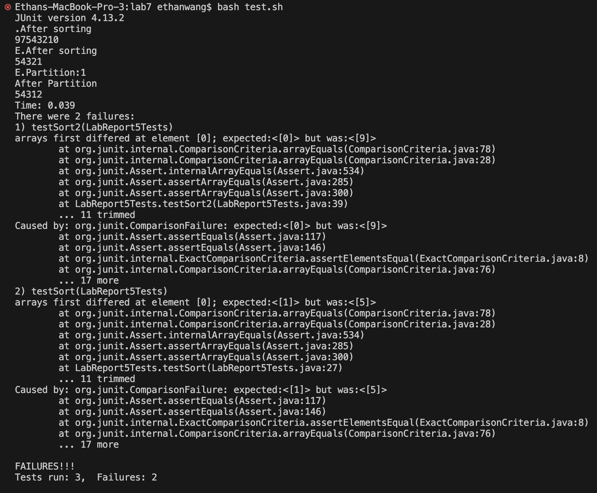

## Part 1
### Student Post
Hi i'm having some trouble running this code. The failure-inducing input was the array ["3","5","4","1","2"]. Down below is a screenshot of the sympton. My guess at the bug is that there is something wrong with the comparing system.

Thanks
### TA response
It looks like your sort is working in reverse. You should try different arrays and see if it is all in reverse. If thats the case then you probably have the compare statement written in reverse.

### Student response
It was working in reverse. Here is a picture of what happened when I inputed a different and longer array. Thanks.

### Setup

The edit to fix the bug was to change the if statement in line 17. Change `A[i].compareTo(A[low]) > 0` to `A[i].compareTo(A[low]) < 0`.

## Part 2
Something I learned in the second half of this quarter is that you can create a bash script that compiles and runs your java files so that you don't need to rewrite it every single time you want to run something. I found this really useful when debugging code. I could just run `bash testJava.sh` instead of the whole `javac` and `java` lines.
